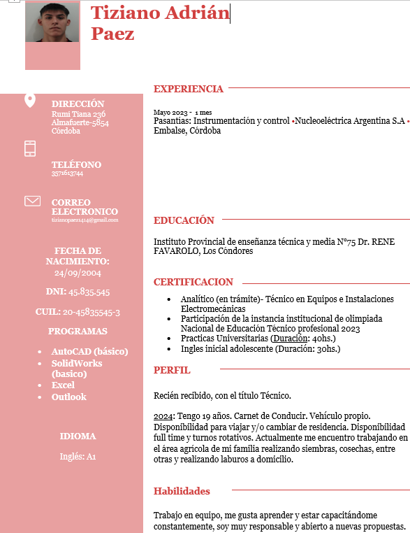

#  LOGO

## Professor: Vera Cristian Gonzalo.

## Presentación de la estructura del monorepositorio
TP#1. Fundamentos de circuitos electricos 

TP#2. Simulación electrónica

TP#3. CLC

TP#4. Completar estructura ABP en GitHub y colocar perfil del estudiante

TP#5. Síntesis de funciones lógicas y circuitos secuenciales

TP#10. Entrenador basico
##

# Resumen del repositorio actual TP#5
Objetivos

1.Comprender los conceptos fundamentales de análisis y síntesis de circuitos combinacionales.

2.Familiarizarse con las técnicas de simplificación de funciones booleanas mediante minitérminos y maxitérminos.

3.Diseñar circuitos combinacionales utilizando puertas lógicas básicas.

4.Introducirse en el concepto de circuitos secuenciales y flip-flops como elementos de memoria.

# Desarrollo del trabajo práctico

1.Análisis de circuitos combinacionales Dado el siguiente circuito combinacional que utiliza puertas AND, OR y NOT, analizar la función lógica que representa y expresarla en forma de minitérminos y maxitérminos.

2.Síntesis de circuitos combinacionales Dada las siguientes funciones lógicas, simplificarlas utilizando el método de Karnaugh y construir un circuito combinacional que la represente utilizando puertas lógicas básicas.

a. F(A, B, C, D) = Σm(1, 3, 5, 6, 9, 11, 12, 14)

b. F(A, B, C, D) = ΠM(2, 4, 7, 8, 10, 13, 14, 15)

3.Diseño de un decodificador Diseñar un decodificador 3-a-8 utilizando puertas lógicas AND, OR y NOT. El decodificador debe convertir un código binario de 3 bits en 8 salidas, activando una salida única correspondiente al valor binario de entrada.

4.Introducción a circuitos secuenciales y flip-flops Investigar y describir brevemente las características y tipos de flip-flops (SR, D, JK, T). Explicar cómo estos elementos de memoria pueden ser utilizados en circuitos secuenciales.

## Perfil del estudiante

